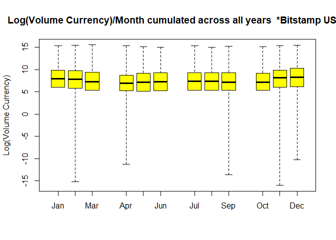
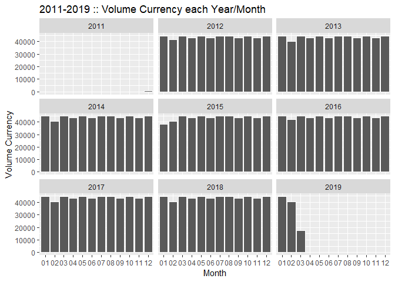

BTC forecaster
================

    ##    Timestamp Open High  Low Close Volume_.BTC. Volume_.Currency.
    ## 1 1325317920 4.39 4.39 4.39  4.39    0.4555809                 2
    ## 2 1325317980  NaN  NaN  NaN   NaN          NaN               NaN
    ## 3 1325318040  NaN  NaN  NaN   NaN          NaN               NaN
    ## 4 1325318100  NaN  NaN  NaN   NaN          NaN               NaN
    ## 5 1325318160  NaN  NaN  NaN   NaN          NaN               NaN
    ## 6 1325318220  NaN  NaN  NaN   NaN          NaN               NaN
    ##   Weighted_Price
    ## 1           4.39
    ## 2            NaN
    ## 3            NaN
    ## 4            NaN
    ## 5            NaN
    ## 6            NaN

``` r
#Wrangle

bitstamp$Time.read <- as.POSIXct(bitstamp$Timestamp, origin = "1970-01-01", tz = "GMT")
bitstamp$Year <- format(as.Date(bitstamp$Time.read, format="%d/%m/%Y"),"%Y")
bitstamp$Month <- format(as.Date(bitstamp$Time.read, format="%d/%m/%Y"),"%m")
bitstamp$YearMonth <- format(as.Date(bitstamp$Time.read, format="%d/%m/%Y"),"%Y-%m")
bitstamp$YearMonthDay <- format(as.Date(bitstamp$Time.read, format="%d/%m/%Y"),"%Y-%m-%d")
bitstamp$Year <- as.factor(bitstamp$Year)
bitstamp$Month <- as.factor(bitstamp$Month)
bitstamp$YearMonth <- as.factor(bitstamp$YearMonth) 
```

``` r
#Summary

summary(bitstamp)
```

    ##    Timestamp              Open              High              Low         
    ##  Min.   :1.325e+09   Min.   :    3.8   Min.   :    3.8   Min.   :    1.5  
    ##  1st Qu.:1.382e+09   1st Qu.:  349.0   1st Qu.:  349.1   1st Qu.:  348.8  
    ##  Median :1.439e+09   Median :  659.6   Median :  660.0   Median :  659.0  
    ##  Mean   :1.439e+09   Mean   : 2654.7   Mean   : 2656.8   Mean   : 2652.3  
    ##  3rd Qu.:1.496e+09   3rd Qu.: 4045.5   3rd Qu.: 4049.1   3rd Qu.: 4042.1  
    ##  Max.   :1.552e+09   Max.   :19665.8   Max.   :19666.0   Max.   :19650.0  
    ##                      NA's   :1227685   NA's   :1227685   NA's   :1227685  
    ##      Close          Volume_.BTC.     Volume_.Currency. Weighted_Price   
    ##  Min.   :    1.5   Min.   :   0.0    Min.   :      0   Min.   :    3.8  
    ##  1st Qu.:  349.0   1st Qu.:   0.4    1st Qu.:    248   1st Qu.:  349.0  
    ##  Median :  659.6   Median :   2.1    Median :   1814   Median :  659.6  
    ##  Mean   : 2654.7   Mean   :  10.7    Mean   :  23959   Mean   : 2654.5  
    ##  3rd Qu.: 4045.4   3rd Qu.:   8.3    3rd Qu.:  13035   3rd Qu.: 4045.1  
    ##  Max.   :19665.8   Max.   :5853.9    Max.   :5483271   Max.   :19663.3  
    ##  NA's   :1227685   NA's   :1227685   NA's   :1227685   NA's   :1227685  
    ##    Time.read                        Year            Month        
    ##  Min.   :2011-12-31 07:52:00   2012   :527040   01     : 350648  
    ##  1st Qu.:2013-10-17 08:56:00   2016   :527040   03     : 329761  
    ##  Median :2015-08-08 21:52:00   2013   :525600   02     : 325440  
    ##  Mean   :2015-08-07 00:36:28   2014   :525600   12     : 313448  
    ##  3rd Qu.:2017-05-25 22:56:00   2017   :525600   05     : 312480  
    ##  Max.   :2019-03-13 00:00:00   2018   :525600   07     : 312480  
    ##                                (Other):622337   (Other):1834560  
    ##    YearMonth       YearMonthDay      
    ##  2012-01:  44640   Length:3778817    
    ##  2012-03:  44640   Class :character  
    ##  2012-05:  44640   Mode  :character  
    ##  2012-07:  44640                     
    ##  2012-08:  44640                     
    ##  2012-10:  44640                     
    ##  (Other):3510977

``` r
str(bitstamp)
```

    ## 'data.frame':    3778817 obs. of  13 variables:
    ##  $ Timestamp        : int  1325317920 1325317980 1325318040 1325318100 1325318160 1325318220 1325318280 1325318340 1325318400 1325318460 ...
    ##  $ Open             : num  4.39 NaN NaN NaN NaN NaN NaN NaN NaN NaN ...
    ##  $ High             : num  4.39 NaN NaN NaN NaN NaN NaN NaN NaN NaN ...
    ##  $ Low              : num  4.39 NaN NaN NaN NaN NaN NaN NaN NaN NaN ...
    ##  $ Close            : num  4.39 NaN NaN NaN NaN NaN NaN NaN NaN NaN ...
    ##  $ Volume_.BTC.     : num  0.456 NaN NaN NaN NaN ...
    ##  $ Volume_.Currency.: num  2 NaN NaN NaN NaN ...
    ##  $ Weighted_Price   : num  4.39 NaN NaN NaN NaN NaN NaN NaN NaN NaN ...
    ##  $ Time.read        : POSIXct, format: "2011-12-31 07:52:00" "2011-12-31 07:53:00" ...
    ##  $ Year             : Factor w/ 9 levels "2011","2012",..: 1 1 1 1 1 1 1 1 1 1 ...
    ##  $ Month            : Factor w/ 12 levels "01","02","03",..: 12 12 12 12 12 12 12 12 12 12 ...
    ##  $ YearMonth        : Factor w/ 88 levels "2011-12","2012-01",..: 1 1 1 1 1 1 1 1 1 1 ...
    ##  $ YearMonthDay     : chr  "2011-12-31" "2011-12-31" "2011-12-31" "2011-12-31" ...

``` r
# Plots

#Log visualisations

boxplot(log(bitstamp$Volume_.BTC.) ~ bitstamp$YearMonth, range = 0, las = 2, ylab = "Log(Volume BTC)", main = "2011-2019 :: Log(Volume BTC)/(Year + Month) & whiskers at ZERO", col = rainbow(9), ylim = c(-18, 8), cex.axis = .72)
```


``` r
boxplot(log(bitstamp$Volume_.Currency.) ~ bitstamp$YearMonth, las = 2, range = 0, ylab = "Log(Vol Currency)", main = "2011-2019 :: Log(Vol Currency)/(Year + Month) & whiskers at ZERO", col = "yellow", , cex.axis = .72)
```


``` r
boxplot(log(bitstamp$Volume_.BTC.) ~ bitstamp$Month, range = 0, ylab = "Log(Volume BTC)", main = "Log(Volume BTC)/Month cumulated across all years  *Bitstamp USD*", names = c("Jan", "Feb", "Mar", "Apr", "May", "Jun", "Jul", "Aug", "Sep", "Oct", "Nov", "Dec"), at = c(1,2,3, 5,6,7, 9,10,11, 13,14,15), col = "orange")
```


``` r
boxplot(log(bitstamp$Volume_.Currency.) ~ bitstamp$Month, range = 0, ylab = "Log(Volume Currency)", main = "Log(Volume Currency)/Month cumulated across all years  *Bitstamp USD*", names = c("Jan", "Feb", "Mar", "Apr", "May", "Jun", "Jul", "Aug", "Sep", "Oct", "Nov", "Dec"), at = c(1,2,3, 5,6,7, 9,10,11, 13,14,15), col = "yellow")
```



``` r
#Volume indicators ggplot

ggplot(bitstamp, aes(x = Month, fill = Volume_.Currency.))+
  geom_bar(col = "white")+
  facet_wrap(~ Year)+
  ggtitle("2011-2019 :: Volume Currency each Year/Month")+
  xlab("Month")+
  ylab("Volume Currency")
```



``` r
ggplot(bitstamp, aes(x = Year, fill = Volume_.Currency.))+
  stat_count(aes(fill = Volume_.Currency.))+
  facet_wrap(~ Month)+
  ggtitle("2011-2019 :: Volume Currency each Month/Year")+
  xlab("Years")+
  ylab("Volume Currency")+
  theme_minimal()
```


``` r
# Python script scrapes data and exports .csv 


train <- read.csv(file.choose()) #Select python output to 20190528
test <- read.csv(file.choose()) #Train to 20190728
testdata <- test[,2]
```

``` r
#Process

train$Date <- as.Date(anytime(train$Date))
test$Date <- as.Date(anytime(test$Date))
train$Volume <- gsub(",", "", train$Volume)
train$Market.Cap <- gsub(",", "", train$Market.Cap)
train$Market.Cap <- as.numeric(train$Market.Cap)
train$Volume <- as.numeric(train$Volume)
```

    ## Warning: NAs introduced by coercion

``` r
#Difference between high and low on each day
a <- matrix(c(0), nrow = 0, ncol = 1)
for(i in 1:nrow(train)){
  a <- rbind(a, train[i,3] - train[i,4])
  i <- i + 1
}
train <- cbind(train,a)

#Volume has missing values#
#Data Manipulation#
fifty_avg <- round(mean(train$Volume[train$a < 50], na.rm = TRUE), digits = 2)
hun_avg <- round(mean(train$Volume[train$a > 50 & train$a < 100], na.rm = TRUE), digits = 2)
hf_avg <- round(mean(train$Volume[train$a > 100 & train$a < 150], na.rm = TRUE), digits = 2)
th_avg <- round(mean(train$Volume[train$a > 150 & train$a < 350], na.rm = TRUE), digits = 2)
for(i in 1:nrow(train)){
  if(is.na(train[i,6])){
    if(train$a[i] < 50){
      train$Volume[i] <- fifty_avg
    } else if(train$a[i] < 100){
      train$Volume[i] <- hun_avg
    } else if(train$a[i] < 150){
      train$Volume[i] <- hf_avg
    } else if(train$a[i] < 350){
      train$Volume[i] <- th_avg
    }else
      print("Uncaught Title")
  }
}
train <- train[, - 8] #Removing column 8
```

``` r
#Plots
ggplot(train, aes(Date, Close..)) + geom_line() + scale_x_date("year") + ylim(0,20000) + ylab("Closing Price")
```


``` r
#Convert data set to time series
Train <- xts(train[, -1], order.by = as.POSIXct(train$Date)) 
tsr <- ts(Train[,4], frequency = 365.25,start = c(2013,4,27))
plot(Train$Close,type='l',lwd = 1.5,col='red', ylim = c(0,10000), main = "Bitcoin Closing Price")
```


``` r
#checking for trends and seasonality
dects <- decompose(tsr) #Obtaining the trends and seasonality
plot(dects)
```


It can be seen that there is a uniform seasonal variation in the closing price of bitcoins over the years and the trend has been almost constant till the end of 2016. Hence the forecasting is done based on the data from Nov 7, 2016 for standard algorithms and the entire data set for Multilinear and Bayesian regression. The following are the forecasting algorithms used in predicting the price of bitcoins and each of it is reported with its prediction plots and accuracy.

**Holt’s Forecasting model:**

Holt’s forecasting or Double exponential smoothing method uses exponential smoothing based on the given input values of alpha and beta. Based on this data and the trend, we have chosen alpha as 0.2 and beta as 0.1057 for this model. Initially the model is constructed using Holt’s algorithm and this model is used to predict the forecasted price for bitcoins for the next 10 days. The dark blue line in the graph below displays the forecasted values and the light blue band displays the confidence intervals.

``` r
holtt <-  holt(Train[1289:1655,'Close..'], type = "additive", damped = F) #holt forecast values
holtf <- forecast(holtt, h = 10)
holtdf <- as.data.frame(holtf)
head(holtdf)
```

    ##          Point Forecast    Lo 80    Hi 80    Lo 95    Hi 95
    ## 31708801       7179.349 7021.653 7337.044 6938.174 7420.523
    ## 31795201       7215.675 6993.352 7437.998 6875.662 7555.688
    ## 31881601       7252.002 6978.993 7525.010 6834.470 7669.533
    ## 31968001       7288.328 6971.795 7604.861 6804.232 7772.424
    ## 32054401       7324.655 6969.110 7680.199 6780.896 7868.413
    ## 32140801       7360.981 6969.579 7752.383 6762.383 7959.579

``` r
plot(holtf, ylim = c(0,10000)) 
```


**Exponential Triple Smoothing:**

Exponential triple smoothing is an algorithm which estimates the initial states and smoothing parameters of a forecast by optimizing the likelihood function to find the local minimum and is restricted within a parametric space to make sure data is forecastable. The dark line in the forecasting graph points towards the forecasted values and the light blue band refers to the confidence interval.

``` r
ETS <- ets((Train[,'Close..'])) # ETS forecast values
ETSf <- forecast(ETS, h = 10)
etsdf <- as.data.frame(ETSf)
plot(forecast(ETS, h = 10), ylim = c(0,20000)) 
```


``` r
etsp <- predict(ETS, n.ahead = 10, prediction.interval = T, level = 0.95)
```

**ARIMA forecasting:**

Autoregressive Integrated Moving Average forecasting is a method extensively used for time series forecasting. It divides the time series data into models based on the number of time lags in the autoregressive model, the differencing and the order of the moving average model. R provides functionality for two kinds of ARIMA models. One is the auto.arima function which automatically fits the data to the best possible order and other one is ARIMA forecasting in which the order needs to be determined based on the ACF and PACF plots. Both the models are created for forecasting and are compared for accuracy.

``` r
tsdf <- diff(Train[,4], lag = 2)
tsdf <- tsdf[!is.na(tsdf)]
adf.test(tsdf)
```

    ## Warning in adf.test(tsdf): p-value smaller than printed p-value

    ## 
    ##  Augmented Dickey-Fuller Test
    ## 
    ## data:  tsdf
    ## Dickey-Fuller = -12.77, Lag order = 13, p-value = 0.01
    ## alternative hypothesis: stationary

``` r
plot(tsdf, type = 1, ylim = c(-1000, 1000))  
```


``` r
#ACF AND PACF plots
acf(tsdf)
```


``` r
pacf(tsdf)   
```


``` r
gege <- arima(Train[,4], order = c(4,2,11))
```

    ## Warning in arima(Train[, 4], order = c(4, 2, 11)): possible convergence
    ## problem: optim gave code = 1

``` r
gegef <- as.data.frame(forecast(gege, h = 61))

gegefct <- cbind(test, gegef[,1])
plot(forecast(gege, h = 10), ylim = c(0,10000))
```


``` r
ggplot() + geom_line(data = gegefct, aes(Date, gegefct[,2]), color = "blue") + geom_line(data = gegefct, aes(Date, gegefct[,3]), color = "Dark Red")
```


**Forecasting using Bayesian Regression:**

Bayesian linear regression is one of the ways to deal with linear regression. Here, the statistical investigation is attempted inside the setting of Bayesian derivation. The earlier conviction about the parameters is joined with the information's probability work as per Bayes hypothesis to yield the back conviction about the parameters and. This data model is that an information vector x of length m duplicates a coefficient matrix A to create a yield vector y of length d, with Gaussian noise included. This is a conditional model for y just: the appropriation of x isn't required. As we should see, conditional models make a small reference in Bayesian inference. We have created 3 difference Bayesian models-1) Only using the times series of Closing price of bitcoins 2) Simple Bayesian regression using only a single model. 3) 10 different Bayesian models normalized to one.

``` r
ss <- AddLocalLinearTrend(list(), Train[,4]) #Adding linear trend to model
ss <- AddSeasonal(ss, Train[,4], nseasons = 365) #Adding seasonal trend to model
model1 <- bsts(Train[,4],
               state.specification = ss,
               niter = 10)
```

    ## =-=-=-=-= Iteration 0 Thu Aug 01 08:49:22 2019
    ##  =-=-=-=-=
    ## =-=-=-=-= Iteration 1 Thu Aug 01 09:30:46 2019
    ##  =-=-=-=-=
    ## =-=-=-=-= Iteration 2 Thu Aug 01 09:35:20 2019
    ##  =-=-=-=-=
    ## =-=-=-=-= Iteration 3 Thu Aug 01 09:39:21 2019
    ##  =-=-=-=-=
    ## =-=-=-=-= Iteration 4 Thu Aug 01 09:43:17 2019
    ##  =-=-=-=-=
    ## =-=-=-=-= Iteration 5 Thu Aug 01 09:46:31 2019
    ##  =-=-=-=-=
    ## =-=-=-=-= Iteration 6 Thu Aug 01 09:50:23 2019
    ##  =-=-=-=-=
    ## =-=-=-=-= Iteration 7 Thu Aug 01 09:54:18 2019
    ##  =-=-=-=-=
    ## =-=-=-=-= Iteration 8 Thu Aug 01 09:58:29 2019
    ##  =-=-=-=-=
    ## =-=-=-=-= Iteration 9 Thu Aug 01 10:02:43 2019
    ##  =-=-=-=-=

``` r
plot(model1, ylim = c(0,10000)) #Plot based on bayesian regression of the model
```


``` r
pred1 <- predict(model1, horizon = 10)
plot(pred1, plot.original = 50,ylim = c(0,9000))
```


``` r
pred1$mean
```

    ##  [1]  9058.370  8599.314  9145.646  9600.286  9610.274  9432.921  9926.119
    ##  [8]  9853.691 10295.408 10904.409

``` r
#accuracy(pred1$mean, testdata)

model2 <- bsts(Close.. ~ ., state.specification = ss,
               niter = 10,
               data = as.data.frame(Train))
```

    ## =-=-=-=-= Iteration 0 Thu Aug 01 10:12:16 2019
    ##  =-=-=-=-=
    ## =-=-=-=-= Iteration 1 Thu Aug 01 10:16:33 2019
    ##  =-=-=-=-=
    ## =-=-=-=-= Iteration 2 Thu Aug 01 10:19:42 2019
    ##  =-=-=-=-=
    ## =-=-=-=-= Iteration 3 Thu Aug 01 10:23:06 2019
    ##  =-=-=-=-=
    ## =-=-=-=-= Iteration 4 Thu Aug 01 10:31:06 2019
    ##  =-=-=-=-=
    ## =-=-=-=-= Iteration 5 Thu Aug 01 10:35:16 2019
    ##  =-=-=-=-=
    ## =-=-=-=-= Iteration 6 Thu Aug 01 10:39:12 2019
    ##  =-=-=-=-=
    ## =-=-=-=-= Iteration 7 Thu Aug 01 10:42:49 2019
    ##  =-=-=-=-=
    ## =-=-=-=-= Iteration 8 Thu Aug 01 10:46:56 2019
    ##  =-=-=-=-=
    ## =-=-=-=-= Iteration 9 Thu Aug 01 10:50:48 2019
    ##  =-=-=-=-=

``` r
model3 <- bsts(Close.. ~ ., state.specification = ss,
               niter = 10,
               data = as.data.frame(Train),
               expected.model.size = 10)
```

    ## =-=-=-=-= Iteration 0 Thu Aug 01 11:00:54 2019
    ##  =-=-=-=-=
    ## =-=-=-=-= Iteration 1 Thu Aug 01 11:04:45 2019
    ##  =-=-=-=-=
    ## =-=-=-=-= Iteration 2 Thu Aug 01 11:08:56 2019
    ##  =-=-=-=-=
    ## =-=-=-=-= Iteration 3 Thu Aug 01 11:12:17 2019
    ##  =-=-=-=-=
    ## =-=-=-=-= Iteration 4 Thu Aug 01 11:15:41 2019
    ##  =-=-=-=-=
    ## =-=-=-=-= Iteration 5 Thu Aug 01 11:19:11 2019
    ##  =-=-=-=-=
    ## =-=-=-=-= Iteration 6 Thu Aug 01 11:22:46 2019
    ##  =-=-=-=-=
    ## =-=-=-=-= Iteration 7 Thu Aug 01 11:26:53 2019
    ##  =-=-=-=-=
    ## =-=-=-=-= Iteration 8 Thu Aug 01 11:30:08 2019
    ##  =-=-=-=-=
    ## =-=-=-=-= Iteration 9 Thu Aug 01 11:33:39 2019
    ##  =-=-=-=-=

``` r
CompareBstsModels(list("Model 1" = model1, "Model 2" = model2, "Model 3" = model3), colors = c("blue", "red", "green"))  
```


